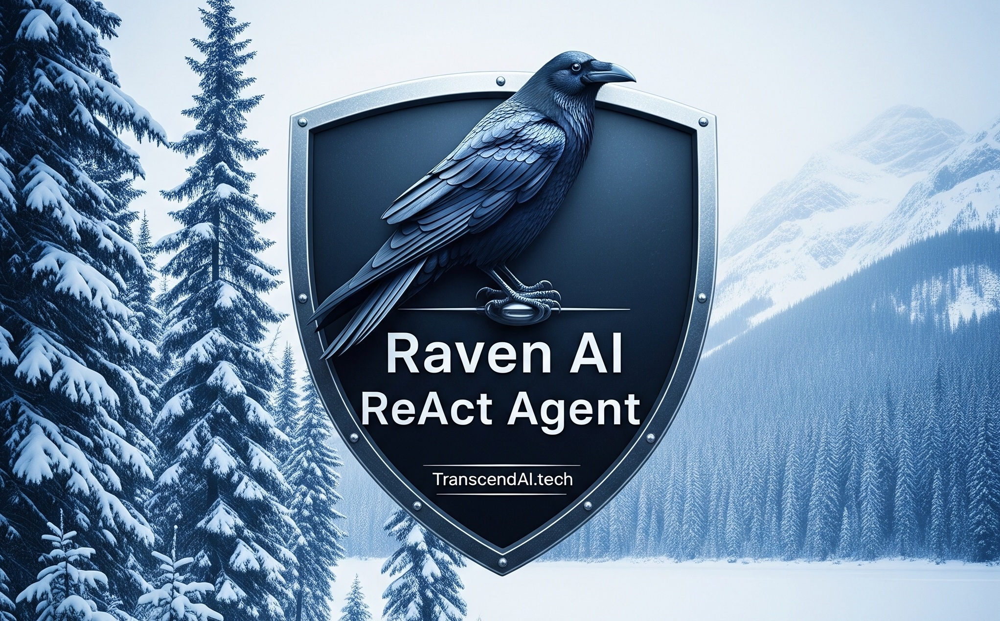

# Sym

This library provides a symbolic computation framework for representing and manipulating mathematical expressions, performing calculus, solving equations, and optimizing tensor-style expression graphs through rewrite rules and an EGraph-based solver.

Pure C#, no native binaries. The repo includes the core engine, rule packs, CLI tools, and the Blazor UI that powers [SymbolicComputation.com](https://symboliccomputation.com).

Sym is online at [SymbolicComputation.com](https://symboliccomputation.com)

License: [MIT](LICENSE)

Sym has grown beyond the earlier Raven-only framing. The same core engine now powers:

- The Blazor UI at `/sym/`
- CLI and scripting workflows through `SymCLI`
- Rule-pack driven algebraic, calculus, equation-solving, tensor, and graph optimization scenarios
- Additional wrappers and companion apps in this repository



Copyright [TranscendAI.tech](https://transcendai.tech) 2026. Authored by Warren Harding. AI assisted.

## Quick start

Open the main solution:

```powershell
dotnet build src/Sym.sln
```

Run the CLI:

```powershell
dotnet run --project src/SymCLI/SymCLI.csproj
```

Run the Blazor UI locally:

```powershell
dotnet run --project src/SymBlazor/SymBlazor.csproj
```

## Repository layout

- `src/Sym`, `src/SymCore`, `src/SymSolvers`, `src/SymRules`: core symbolic engine, solver, and rule libraries
- `src/SymBlazor`: the Blazor WebAssembly UI published to SymbolicComputation.com
- `src/SymCLI`: command-line entry point
- `src/WordsToSym`, `src/SymTools`, `src/HAMM`, `src/AGIMynd`: related tools and companion apps built around the wider Sym ecosystem

## Web deployment

The Blazor deployment notes live in [`src/SymBlazor/DEPLOYMENT.md`](src/SymBlazor/DEPLOYMENT.md).

For the production site, the published app is staged under `/sym/`, with `SymHelp.txt` and `SymUIHelp.html` copied to the site root.
