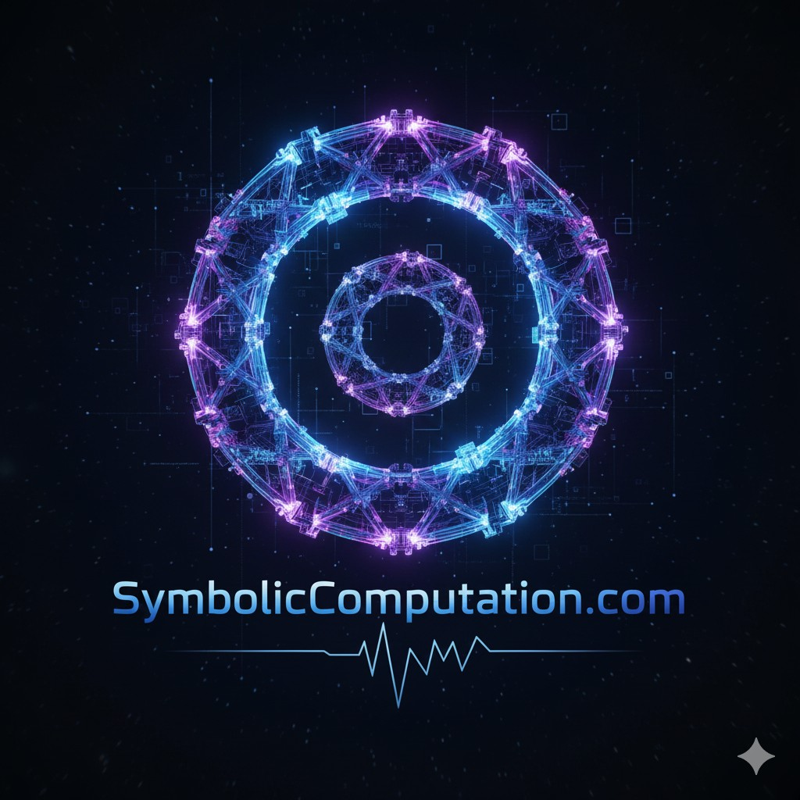

# Sym

This library provides a symbolic computation framework for representing and manipulating mathematical expressions, performing calculus, solving equations, and optimizing tensor-style expression graphs through rewrite rules and an EGraph-based solver.

Pure C#, no native binaries. The repo includes the core engine, rule packs, CLI tools, and the Blazor UI that powers [SymAI.net](https://SymAI.net).

Sym is online at [SymAI.net](https://SymAI.net)

License: [MIT](LICENSE)

Sym has grown beyond the earlier Raven-only framing. The same core engine now powers:

- The Blazor UI at `/sym/`
- CLI and scripting workflows through `SymCLI`
- AI-tooling and Skills-style workflows through `SymCLI` and the `Skills/` folder
- Rule-pack driven algebraic, calculus, equation-solving, tensor, and graph optimization scenarios
- Additional wrappers and companion apps in this repository

## Status note

The `SymCobra` and `SymCobra.CudaNative` projects are included as ongoing work toward COBRA GPU acceleration, but that GPU path is currently incomplete and not functional. The stable, supported path today is the CPU-based Sym engine and its existing wrappers.

## Quick start

Open the main solution:

```powershell
dotnet build src/Sym.sln
```

Run the CLI:

```powershell
dotnet run --project src/SymCLI/SymCLI.csproj
```

Example solve flow:

```powershell
dotnet run --project src/SymCLI/SymCLI.csproj -- problem.ps result.txt
```

Example C# analysis flow:

```powershell
dotnet run --project src/SymCLI/SymCLI.csproj -- analyze csharp-math src out/report.txt --json
```

If you want to expose SymCLI to an AI agent through the checked-in skill wrappers, use:

```powershell
Skills/symcli-skill/symcli.bat analyze csharp-math src out/report.txt --json
```

or on Unix-like systems:

```sh
./Skills/symcli-skill/symcli.sh analyze csharp-math src out/report.txt --json
```

Run the Blazor UI locally:

```powershell
dotnet run --project src/SymBlazor/SymBlazor.csproj
```

## Repository layout

- `src/Sym`, `src/SymCore`, `src/SymSolvers`, `src/SymRules`: core symbolic engine, solver, and rule libraries
- `src/SymBlazor`: the Blazor WebAssembly UI published to SymAI.net
- `src/SymCLI`: command-line entry point
- `Skills/symcli-skill`: repo-relative wrapper scripts and `SKILL.md` instructions for using `SymCLI` as an AI tool / skill
- `src/WordsToSym`, `src/SymTools`, `src/HAMM`, `src/AGIMynd`: related tools and companion apps built around the wider Sym ecosystem
- `smithery.yaml`, `mcp.json`: configuration files for MCP tool registries and marketplaces

## Web deployment

The Blazor deployment notes live in [`src/SymBlazor/DEPLOYMENT.md`](src/SymBlazor/DEPLOYMENT.md).

For the production site, the published app is staged under `/sym/`, with `SymHelp.txt` and `SymUIHelp.html` copied to the site root.

## Hosted MCP Service (Premium)

For production AI agents and high-availability workloads, we offer a managed **Model Context Protocol (MCP)** endpoint hosted on Azure. This service acts as a **"System 2" thinking brain** for AI agents, providing:

- **Zero-Hallucination Math:** Unlike LLMs, Sym uses formal rules to solve equations, ensuring every result is mathematically sound and verifiable.
- **Low-Latency Solve Tiers:** Optimized for real-time agent responses.
- **Agentverse Integration:** Native support for Fetch.ai agents with built-in FET payment handling.
- **Advanced Tensor Optimization:** Specialized high-performance rule-packs for GPU expression fusion, factoring, and scale folding.

### Accessing the Hosted Service

You can access the hosted solver through the following Agentverse address:
`agent1qdd7zue9uh2pj5djudx4udc8m9e55ajtxxlczpps2azvjmj3xmtewgwhfmc`

Please see the [Hosted MCP Service Guide](HOSTED_MCP_GUIDE.md) for full details on message formats, pricing tiers (Lightning, Standard, Deep), and how to submit FET payment hashes. Or visit [SymAI.net/mcp](https://SymAI.net/mcp).

---



Copyright [SymAI.net](https://SymAI.net) 2026. Authored by Warren Harding. AI assisted.
